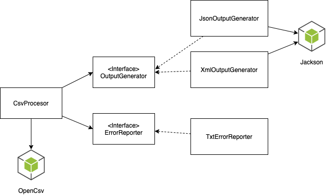

# Overview

This is a CSV Adaptor that can convert each line in a specified input csv file to desired format such as JSON or XML. It uses OpenCSV at the core. 

# Prerequisites

**JDK & JRE Version:** 17

# Getting Started

1. Clone this repository
    ```bash
    git clone https://github.com/asinkxcoswt/csv-adaptor.git
    ```
2. Build
    ```bash
    mvn clean install
    ```
3. Run
   ```bash
   java -jar ./target/csv-adaptor-1.0.jar \
       --input-file=/path/to/your/input.csv \
       --output-dir=/path/to/your/output/dir \
       --record-type=example \
       --output-format=json
   ```
   
   Or just copy the following command to run using our example input file

   ```bash
   java -jar ./target/csv-adaptor-1.0.jar \
       --input-file=src/test/resources/integration-test-inputs/example.csv \
       --output-dir=.temp/ \
       --record-type=example \
       --output-format=json
   ```
   
4. You will see the output files generated in your output directory.

   ```bash
   $ ls -alrt ./.temp
   -rw-r--r--   1 z  staff  161 Mar 27 19:57 2.out.json
   -rw-r--r--   1 z  staff   68 Mar 27 19:57 4.err.txt
   -rw-r--r--   1 z  staff   54 Mar 27 19:57 5.err.txt
   -rw-r--r--   1 z  staff   46 Mar 27 19:57 6.err.txt
   drwxr-xr-x   7 z  staff  224 Mar 27 19:57 .
   -rw-r--r--   1 z  staff  161 Mar 27 19:57 3.out.json
   drwxr-xr-x@ 15 z  staff  480 Mar 27 19:58 ..
   ```


# Parameters

## --input-file

- **Description:** Path to your input csv file
- **Required:** Yes

## --output-file

- **Description:** The directory you want the output files to be in. It will be created automatically if not exist.
- **Required:** Yes

## --record-type

- **Description:** The configuration set you want to use to validate and convert data type for supported fields. We have 2 built-in record types
   - `default`: This configuration set has 0 supported fields, which means the program will parse the value of every field in the input file into `String`.
   - `example`: This is intended to show how you can define a configuration set. Please look into the class at `src/main/java/com/littlepawcraft/csvadaptor/records/ExampleRecord.java`, you will see, for example, that the field `integerNumber` will be parsed to `Integer` using OpenCsv's built-in converter, and `phoneField` will be parsed and validated using the customer converter.

- **Default Value:** `default`

## --output-format

- **Description:** Currently support 2 types, json and xml.
- **Default Value:** json

# Outputs and errors

Each line in the input file will be parsed into a corresponding file in the output directory. Every output file has the line number in the file name. If parsing succeeds, the output file will be `{lineNumber}.out.json` or `{lineNumber}.out.xml`. If the parsing fails, an error file will be generated `{lineNumber}.err.txt` which contains the error message for that line.

# Adding a new record type


1. Create a class under `src/main/java/com/littlepawcraft/csvadaptor/records`, which extends `com.littlepawcraft.csvadaptor.records.Record`.
2. Create fields and annotated them with the appropriate annotation and converter, See `src/main/java/com/littlepawcraft/csvadaptor/records/ExampleRecord.java` for an example.
    ```java
    public class ExampleRecord extends Record {
    
        @CsvBindByName
        private String stringField;
    
        @CsvBindByName
        private Integer integerNumber;
    
        @CsvBindByName
        private Long longNumber;
    
        @CsvBindByName
        private Short shortNumber;
    
        @CsvBindByName
        private Byte byteNumber;
    
        @CsvCustomBindByName(converter = PhoneNumberConverter.class)
        private String phoneField;
    
        @CsvCustomBindByName(converter = EmailAddressConverter.class)
        private String emailField;
    }
    ```
3. Edit `src/main/java/com/littlepawcraft/csvadaptor/Config.java`, adding your new record type to the registry.
    ```java
    @Configuration
    public class Config {
    
        @Bean
        RecordTypeRegistry recordTypeRegistry() {
            return new RecordTypeRegistry()
                    .add("default", NoFieldsRecord.class)
                    .add("example", ExampleRecord.class)
                    .add("you-type", YourRecord.class);
        }
    }
    ```
   
4. Build and run the program with your new type
   ```bash
   java -jar ./target/csv-adaptor-1.0.jar \
       --input-file=src/test/resources/integration-test-inputs/example.csv \
       --output-dir=.temp/ \
       --record-type=your-type \
       --output-format=json
   ```
   
# System Components



# Performance

# Test

# Specification