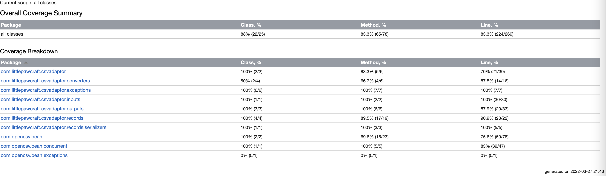
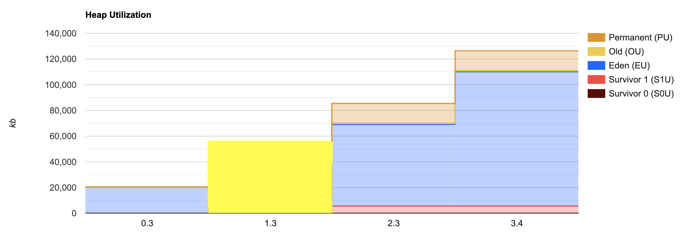
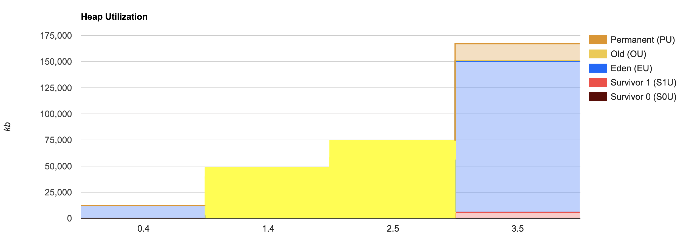
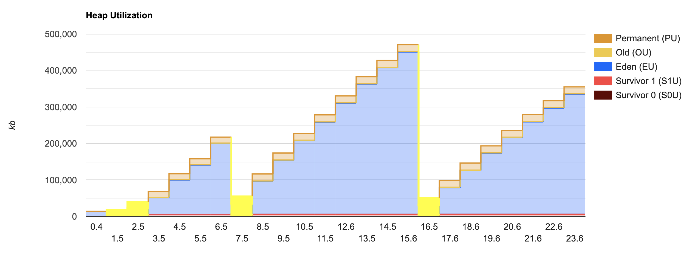
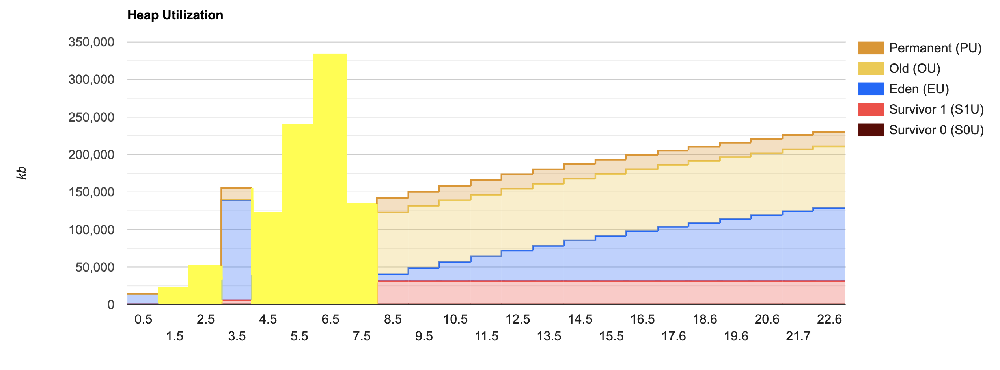

# Overview

This is a CSV Adaptor that can convert each line in a specified input csv file to desired format such as JSON or XML. It uses OpenCSV at the core. 

# Prerequisites

**JDK & JRE Version:** 17

# Getting Started

1. Clone this repository
    ```bash
    git clone https://github.com/asinkxcoswt/csv-adaptor.git
    ```
2. Build
    ```bash
    mvn clean install
    ```
3. Run
   ```bash
   java -jar ./target/csv-adaptor-1.0.jar \
       --input-file=/path/to/your/input.csv \
       --output-dir=/path/to/your/output/dir \
       --record-type=example \
       --output-format=json
   ```
   
   Or just copy the following command to run using our example input file

   ```bash
   java -jar ./target/csv-adaptor-1.0.jar \
       --input-file=src/test/resources/integration-test-inputs/example.csv \
       --output-dir=.temp/ \
       --record-type=example \
       --output-format=json
   ```
   
4. You will see the output files generated in your output directory.

   ```bash
   $ ls -alrt ./.temp
   -rw-r--r--   1 z  staff  161 Mar 27 19:57 2.out.json
   -rw-r--r--   1 z  staff   68 Mar 27 19:57 4.err.txt
   -rw-r--r--   1 z  staff   54 Mar 27 19:57 5.err.txt
   -rw-r--r--   1 z  staff   46 Mar 27 19:57 6.err.txt
   drwxr-xr-x   7 z  staff  224 Mar 27 19:57 .
   -rw-r--r--   1 z  staff  161 Mar 27 19:57 3.out.json
   drwxr-xr-x@ 15 z  staff  480 Mar 27 19:58 ..
   ```


# Parameters

## --input-file

- **Description:** Path to your input csv file
- **Required:** Yes

## --output-file

- **Description:** The directory you want the output files to be in. It will be created automatically if not exist.
- **Required:** Yes

## --record-type

- **Description:** The configuration set you want to use to validate and convert data type for supported fields. We have 2 built-in record types
   - `default`: This configuration set has 0 supported fields, which means the program will parse the value of every field in the input file into `String`.
   - `example`: This is intended to show how you can define a configuration set. Please look into the class at `src/main/java/com/littlepawcraft/csvadaptor/records/ExampleRecord.java`, you will see, for example, that the field `integerNumber` will be parsed to `Integer` using OpenCsv's built-in converter, and `phoneField` will be parsed and validated using the customer converter.

- **Default Value:** `default`

## --output-format

- **Description:** Currently support 2 types, json and xml.
- **Default Value:** json

# Outputs and errors

Each line in the input file will be parsed into a corresponding file in the output directory. Every output file has the line number in the file name. If parsing succeeds, the output file will be `{lineNumber}.out.json` or `{lineNumber}.out.xml`. If the parsing fails, an error file will be generated `{lineNumber}.err.txt` which contains the error message for that line.

# Adding a new record type


1. Create a class under `src/main/java/com/littlepawcraft/csvadaptor/records`, which extends `com.littlepawcraft.csvadaptor.records.Record`.
2. Create fields and annotated them with the appropriate annotation and converter, See `src/main/java/com/littlepawcraft/csvadaptor/records/ExampleRecord.java` for an example.
    ```java
    public class ExampleRecord extends Record {
    
        @CsvBindByName
        private String stringField;
    
        @CsvBindByName
        private Integer integerNumber;
    
        @CsvBindByName
        private Long longNumber;
    
        @CsvBindByName
        private Short shortNumber;
    
        @CsvBindByName
        private Byte byteNumber;
    
        @CsvCustomBindByName(converter = PhoneNumberConverter.class)
        private String phoneField;
    
        @CsvCustomBindByName(converter = EmailAddressConverter.class)
        private String emailField;
    }
    ```
3. Edit `src/main/java/com/littlepawcraft/csvadaptor/Config.java`, adding your new record type to the registry.
    ```java
    @Configuration
    public class Config {
    
        @Bean
        RecordTypeRegistry recordTypeRegistry() {
            return new RecordTypeRegistry()
                    .add("default", NoFieldsRecord.class)
                    .add("example", ExampleRecord.class)
                    .add("you-type", YourRecord.class);
        }
    }
    ```
   
4. Build and run the program with your new type
   ```bash
   java -jar ./target/csv-adaptor-1.0.jar \
       --input-file=src/test/resources/integration-test-inputs/example.csv \
       --output-dir=.temp/ \
       --record-type=your-type \
       --output-format=json
   ```
   
# System Components


# Test




# Performance

OpenCsv supports both multi-thread and single-thread executions. We test both cases against input files of size 10K and 100K, the time and memory for each case is in the following table.

|                    | Number Of Records | Time | Memory  |
|--------------------|-------------------|------|---------|
| Single Thread      | 10K               |    3 | 125,439 |
| Thread Pool Size 8 | 10K               |    3 | 166,114 |
| Single Thread      | 100K              |   23 | 463,567 |
| Thread Pool Size 8 | 100K              |   22 | 230,074 |

You can reproduce this result by running as follows

1. Run `./cli.sh load_test_prepare`, this will download the 100K-records and 10K-records csv data
2. Run `./cli.sh load_test_run`, this will execute the 4 cases, one at a time.

After finished, you can see the execution time for each case in the log. For the memory, you can copy the jstat output from the log and use [this website](http://nix-on.blogspot.com/2015/01/java-jstat-how-to-visualize-garbage.html) to visualize them.

### Single Thread 10k


### Parallel (Thread Pool Size 8) 10k


### Single Thread 100k


### Parallel (Thread Pool Size 8) 100k


```text

 ______________________
 < load_test_run >
 ----------------------
        \   ^__^
         \  (..)\_______
            (__)\       )\/
                ||----w |
                ||     ||


 ______________________
 < parallel_10k >
 ----------------------
        \   ^__^
         \  (..)\_______
            (__)\       )\/
                ||----w |
                ||     ||

7580:
 garbage-first heap   total 1048576K, used 8662K [0x00000007c0000000, 0x0000000800000000)
  region size 1024K, 8 young (8192K), 0 survivors (0K)
 Metaspace       used 1481K, committed 1728K, reserved 1056768K
  class space    used 147K, committed 256K, reserved 1048576K
Timestamp           S0C         S1C         S0U         S1U          EC           EU           OC           OU          MC         MU       CCSC      CCSU     YGC     YGCT     FGC    FGCT     CGC    CGCT       GCT   
            0.4         0.0         0.0         0.0         0.0      55296.0      12288.0     993280.0          0.0        0.0        0.0       0.0       0.0      0     0.000     0     0.000     0     0.000     0.000
            1.4         0.0      4096.0         0.0      3748.0      78848.0      34816.0     965632.0        980.0     8960.0     8702.6    1216.0    1111.6      1     0.004     0     0.000     0     0.000     0.004
            2.5         0.0      6144.0         0.0      5919.7     346112.0      51200.0     696320.0        980.0    16128.0    15811.3    2112.0    1971.2      2     0.009     0     0.000     0     0.000     0.009
            3.5         0.0      6144.0         0.0      5919.7     346112.0     144384.0     696320.0        980.0    16128.0    15811.3    2112.0    1971.2      2     0.009     0     0.000     0     0.000     0.009
03:23:28.829 [main] INFO com.littlepawcraft.csvadaptor.CsvAdaptorApplication - STARTING THE APPLICATION

  .   ____          _            __ _ _
 /\\ / ___'_ __ _ _(_)_ __  __ _ \ \ \ \
( ( )\___ | '_ | '_| | '_ \/ _` | \ \ \ \
 \\/  ___)| |_)| | | | | || (_| |  ) ) ) )
  '  |____| .__|_| |_|_| |_\__, | / / / /
 =========|_|==============|___/=/_/_/_/
 :: Spring Boot ::                (v2.6.5)

2022-03-28 03:23:29.570  INFO 7580 --- [           main] c.l.csvadaptor.CsvAdaptorApplication     : Starting CsvAdaptorApplication v1.0 using Java 17.0.2 on Zs-MacBook-Pro.local with PID 7580 (/Users/z/work/codapayments/csv-adaptor/target/csv-adaptor-1.0.jar started by z in /Users/z/work/codapayments/csv-adaptor)
2022-03-28 03:23:29.571  INFO 7580 --- [           main] c.l.csvadaptor.CsvAdaptorApplication     : No active profile set, falling back to 1 default profile: "default"
2022-03-28 03:23:30.102  INFO 7580 --- [           main] c.l.csvadaptor.CsvAdaptorApplication     : Started CsvAdaptorApplication in 1.106 seconds (JVM running for 1.685)
2022-03-28 03:23:30.104  INFO 7580 --- [           main] c.l.csvadaptor.CsvAdaptorApplication     : inputFile: .temp/csv-adaptor-performance-test-data-10k.csv
2022-03-28 03:23:30.104  INFO 7580 --- [           main] c.l.csvadaptor.CsvAdaptorApplication     : outputDir: .temp/outputs_parallel_10k
2022-03-28 03:23:30.104  INFO 7580 --- [           main] c.l.csvadaptor.CsvAdaptorApplication     : outputFormat: json
2022-03-28 03:23:30.104  INFO 7580 --- [           main] c.l.csvadaptor.CsvAdaptorApplication     : recordType: example
2022-03-28 03:23:32.420  INFO 7580 --- [           main] c.l.csvadaptor.CsvAdaptorApplication     : Elapse (seconds): 3
2022-03-28 03:23:32.420  INFO 7580 --- [           main] c.l.csvadaptor.CsvAdaptorApplication     : APPLICATION FINISHED

 ______________________
 < single_10k >
 ----------------------
        \   ^__^
         \  (..)\_______
            (__)\       )\/
                ||----w |
                ||     ||

7585:
 garbage-first heap   total 1048576K, used 10196K [0x00000007c0000000, 0x0000000800000000)
  region size 1024K, 9 young (9216K), 0 survivors (0K)
 Metaspace       used 2225K, committed 2368K, reserved 1056768K
  class space    used 229K, committed 320K, reserved 1048576K
Timestamp           S0C         S1C         S0U         S1U          EC           EU           OC           OU          MC         MU       CCSC      CCSU     YGC     YGCT     FGC    FGCT     CGC    CGCT       GCT   
            0.3         0.0         0.0         0.0         0.0      55296.0      20480.0     993280.0          0.0        0.0        0.0       0.0       0.0      0     0.000     0     0.000     0     0.000     0.000
            1.3         0.0      6144.0         0.0      5650.0     320512.0      33792.0     721920.0        980.0    15616.0    15341.6    2048.0    1911.9      2     0.007     0     0.000     0     0.000     0.007
            2.3         0.0      6144.0         0.0      5650.0     320512.0      63488.0     721920.0        980.0    15616.0    15341.6    2048.0    1911.9      2     0.007     0     0.000     0     0.000     0.007
            3.4         0.0      6144.0         0.0      5650.0     320512.0     104448.0     721920.0        980.0    15616.0    15341.6    2048.0    1911.9      2     0.007     0     0.000     0     0.000     0.007
03:23:34.319 [main] INFO com.littlepawcraft.csvadaptor.CsvAdaptorApplication - STARTING THE APPLICATION

  .   ____          _            __ _ _
 /\\ / ___'_ __ _ _(_)_ __  __ _ \ \ \ \
( ( )\___ | '_ | '_| | '_ \/ _` | \ \ \ \
 \\/  ___)| |_)| | | | | || (_| |  ) ) ) )
  '  |____| .__|_| |_|_| |_\__, | / / / /
 =========|_|==============|___/=/_/_/_/
 :: Spring Boot ::                (v2.6.5)

2022-03-28 03:23:34.747  INFO 7585 --- [           main] c.l.csvadaptor.CsvAdaptorApplication     : Starting CsvAdaptorApplication v1.0 using Java 17.0.2 on Zs-MacBook-Pro.local with PID 7585 (/Users/z/work/codapayments/csv-adaptor/target/csv-adaptor-1.0.jar started by z in /Users/z/work/codapayments/csv-adaptor)
2022-03-28 03:23:34.749  INFO 7585 --- [           main] c.l.csvadaptor.CsvAdaptorApplication     : No active profile set, falling back to 1 default profile: "default"
2022-03-28 03:23:35.178  INFO 7585 --- [           main] c.l.csvadaptor.CsvAdaptorApplication     : Started CsvAdaptorApplication in 0.73 seconds (JVM running for 1.096)
2022-03-28 03:23:35.180  INFO 7585 --- [           main] c.l.csvadaptor.CsvAdaptorApplication     : inputFile: .temp/csv-adaptor-performance-test-data-10k.csv
2022-03-28 03:23:35.180  INFO 7585 --- [           main] c.l.csvadaptor.CsvAdaptorApplication     : outputDir: .temp/outputs_single_10k
2022-03-28 03:23:35.180  INFO 7585 --- [           main] c.l.csvadaptor.CsvAdaptorApplication     : outputFormat: json
2022-03-28 03:23:35.180  INFO 7585 --- [           main] c.l.csvadaptor.CsvAdaptorApplication     : recordType: example
2022-03-28 03:23:38.206  INFO 7585 --- [           main] c.l.csvadaptor.CsvAdaptorApplication     : Elapse (seconds): 3
2022-03-28 03:23:38.206  INFO 7585 --- [           main] c.l.csvadaptor.CsvAdaptorApplication     : APPLICATION FINISHED

 ______________________
 < parallel_100k >
 ----------------------
        \   ^__^
         \  (..)\_______
            (__)\       )\/
                ||----w |
                ||     ||

7591:
 garbage-first heap   total 1048576K, used 8662K [0x00000007c0000000, 0x0000000800000000)
  region size 1024K, 8 young (8192K), 0 survivors (0K)
 Metaspace       used 1438K, committed 1536K, reserved 1056768K
  class space    used 144K, committed 192K, reserved 1048576K
Timestamp           S0C         S1C         S0U         S1U          EC           EU           OC           OU          MC         MU       CCSC      CCSU     YGC     YGCT     FGC    FGCT     CGC    CGCT       GCT   
            0.5         0.0         0.0         0.0         0.0      55296.0      14336.0     993280.0          0.0        0.0        0.0       0.0       0.0      0     0.000     0     0.000     0     0.000     0.000
            1.5         0.0      4096.0         0.0      3744.0      77824.0       8192.0     966656.0        980.0     8960.0     8698.9    1216.0    1111.6      1     0.008     0     0.000     0     0.000     0.008
            2.5         0.0      6144.0         0.0      5829.4     333824.0      28672.0     708608.0        980.0    15616.0    15415.9    2048.0    1931.1      2     0.014     0     0.000     0     0.000     0.014
            3.5         0.0      6144.0         0.0      5829.4     333824.0     133120.0     708608.0        980.0    15616.0    15415.9    2048.0    1931.1      2     0.014     0     0.000     0     0.000     0.014
            4.5         0.0     40960.0         0.0     40960.0     203776.0      39936.0     803840.0      21345.5    19520.0    19279.2    2432.0    2341.7      3     0.104     0     0.000     0     0.000     0.104
            5.5         0.0     22528.0         0.0     22207.8     211968.0     137216.0     814080.0      60101.0    19520.0    19281.5    2432.0    2341.7      5     0.162     0     0.000     0     0.000     0.162
            6.5         0.0     27648.0         0.0     27648.0     247808.0     217088.0     773120.0      68958.5    19520.0    19284.1    2432.0    2341.7      6     0.182     0     0.000     0     0.000     0.182
            7.5         0.0     31744.0         0.0     31232.0     320512.0       1024.0     696320.0      82278.0    19520.0    19284.7    2432.0    2341.7      7     0.210     0     0.000     0     0.000     0.210
            8.5         0.0     31744.0         0.0     31232.0     320512.0       9216.0     696320.0      82278.0    19520.0    19284.7    2432.0    2341.7      7     0.210     0     0.000     0     0.000     0.210
            9.5         0.0     31744.0         0.0     31232.0     320512.0      17408.0     696320.0      82278.0    19520.0    19284.7    2432.0    2341.7      7     0.210     0     0.000     0     0.000     0.210
           10.5         0.0     31744.0         0.0     31232.0     320512.0      25600.0     696320.0      82278.0    19520.0    19284.7    2432.0    2341.7      7     0.210     0     0.000     0     0.000     0.210
           11.5         0.0     31744.0         0.0     31232.0     320512.0      32768.0     696320.0      82278.0    19520.0    19284.7    2432.0    2341.7      7     0.210     0     0.000     0     0.000     0.210
           12.5         0.0     31744.0         0.0     31232.0     320512.0      40960.0     696320.0      82278.0    19520.0    19284.7    2432.0    2341.7      7     0.210     0     0.000     0     0.000     0.210
           13.5         0.0     31744.0         0.0     31232.0     320512.0      47104.0     696320.0      82278.0    19520.0    19284.7    2432.0    2341.7      7     0.210     0     0.000     0     0.000     0.210
           14.5         0.0     31744.0         0.0     31232.0     320512.0      54272.0     696320.0      82278.0    19520.0    19284.7    2432.0    2341.7      7     0.210     0     0.000     0     0.000     0.210
           15.5         0.0     31744.0         0.0     31232.0     320512.0      60416.0     696320.0      82278.0    19520.0    19284.7    2432.0    2341.7      7     0.210     0     0.000     0     0.000     0.210
           16.5         0.0     31744.0         0.0     31232.0     320512.0      66560.0     696320.0      82278.0    19520.0    19284.7    2432.0    2341.7      7     0.210     0     0.000     0     0.000     0.210
           17.6         0.0     31744.0         0.0     31232.0     320512.0      72704.0     696320.0      82278.0    19520.0    19284.7    2432.0    2341.7      7     0.210     0     0.000     0     0.000     0.210
           18.6         0.0     31744.0         0.0     31232.0     320512.0      77824.0     696320.0      82278.0    19520.0    19284.7    2432.0    2341.7      7     0.210     0     0.000     0     0.000     0.210
           19.6         0.0     31744.0         0.0     31232.0     320512.0      82944.0     696320.0      82278.0    19520.0    19284.7    2432.0    2341.7      7     0.210     0     0.000     0     0.000     0.210
           20.6         0.0     31744.0         0.0     31232.0     320512.0      88064.0     696320.0      82278.0    19520.0    19284.7    2432.0    2341.7      7     0.210     0     0.000     0     0.000     0.210
           21.7         0.0     31744.0         0.0     31232.0     320512.0      93184.0     696320.0      82278.0    19520.0    19284.7    2432.0    2341.7      7     0.210     0     0.000     0     0.000     0.210
           22.6         0.0     31744.0         0.0     31232.0     320512.0      97280.0     696320.0      82278.0    19520.0    19284.7    2432.0    2341.7      7     0.210     0     0.000     0     0.000     0.210
03:23:40.274 [main] INFO com.littlepawcraft.csvadaptor.CsvAdaptorApplication - STARTING THE APPLICATION

  .   ____          _            __ _ _
 /\\ / ___'_ __ _ _(_)_ __  __ _ \ \ \ \
( ( )\___ | '_ | '_| | '_ \/ _` | \ \ \ \
 \\/  ___)| |_)| | | | | || (_| |  ) ) ) )
  '  |____| .__|_| |_|_| |_\__, | / / / /
 =========|_|==============|___/=/_/_/_/
 :: Spring Boot ::                (v2.6.5)

2022-03-28 03:23:41.053  INFO 7591 --- [           main] c.l.csvadaptor.CsvAdaptorApplication     : Starting CsvAdaptorApplication v1.0 using Java 17.0.2 on Zs-MacBook-Pro.local with PID 7591 (/Users/z/work/codapayments/csv-adaptor/target/csv-adaptor-1.0.jar started by z in /Users/z/work/codapayments/csv-adaptor)
2022-03-28 03:23:41.055  INFO 7591 --- [           main] c.l.csvadaptor.CsvAdaptorApplication     : No active profile set, falling back to 1 default profile: "default"
2022-03-28 03:23:42.026  INFO 7591 --- [           main] c.l.csvadaptor.CsvAdaptorApplication     : Started CsvAdaptorApplication in 1.54 seconds (JVM running for 2.14)
2022-03-28 03:23:42.029  INFO 7591 --- [           main] c.l.csvadaptor.CsvAdaptorApplication     : inputFile: .temp/csv-adaptor-performance-test-data.csv
2022-03-28 03:23:42.029  INFO 7591 --- [           main] c.l.csvadaptor.CsvAdaptorApplication     : outputDir: .temp/outputs_parallel_10k
2022-03-28 03:23:42.029  INFO 7591 --- [           main] c.l.csvadaptor.CsvAdaptorApplication     : outputFormat: json
2022-03-28 03:23:42.029  INFO 7591 --- [           main] c.l.csvadaptor.CsvAdaptorApplication     : recordType: example
2022-03-28 03:24:03.192  INFO 7591 --- [           main] c.l.csvadaptor.CsvAdaptorApplication     : Elapse (seconds): 22
2022-03-28 03:24:03.194  INFO 7591 --- [           main] c.l.csvadaptor.CsvAdaptorApplication     : APPLICATION FINISHED

 ______________________
 < single_100k >
 ----------------------
        \   ^__^
         \  (..)\_______
            (__)\       )\/
                ||----w |
                ||     ||

7599:
 garbage-first heap   total 1048576K, used 8662K [0x00000007c0000000, 0x0000000800000000)
  region size 1024K, 8 young (8192K), 0 survivors (0K)
 Metaspace       used 1471K, committed 1664K, reserved 1056768K
  class space    used 148K, committed 256K, reserved 1048576K
Timestamp           S0C         S1C         S0U         S1U          EC           EU           OC           OU          MC         MU       CCSC      CCSU     YGC     YGCT     FGC    FGCT     CGC    CGCT       GCT   
            0.4         0.0         0.0         0.0         0.0      55296.0      14336.0     993280.0          0.0        0.0        0.0       0.0       0.0      0     0.000     0     0.000     0     0.000     0.000
            1.5         0.0      4096.0         0.0      3792.0      78848.0       4096.0     965632.0        980.0     8960.0     8703.3    1216.0    1111.6      1     0.005     0     0.000     0     0.000     0.005
            2.5         0.0      6144.0         0.0      5828.8     237568.0      16384.0     804864.0        980.0    16512.0    16276.7    2176.0    2044.2      2     0.011     0     0.000     0     0.000     0.011
            3.5         0.0      6144.0         0.0      5828.8     237568.0      46080.0     804864.0        980.0    16512.0    16276.7    2176.0    2044.2      2     0.011     0     0.000     0     0.000     0.011
            4.5         0.0      6144.0         0.0      5828.8     237568.0      94208.0     804864.0        980.0    16512.0    16276.7    2176.0    2044.2      2     0.011     0     0.000     0     0.000     0.011
            5.5         0.0      6144.0         0.0      5828.8     237568.0     135168.0     804864.0        980.0    16512.0    16276.7    2176.0    2044.2      2     0.011     0     0.000     0     0.000     0.011
            6.5         0.0      6144.0         0.0      5828.8     237568.0     194560.0     804864.0        980.0    16512.0    16276.7    2176.0    2044.2      2     0.011     0     0.000     0     0.000     0.011
            7.5         0.0      7168.0         0.0      6513.0     483328.0      28672.0     558080.0        980.0    19392.0    19151.5    2432.0    2322.8      3     0.016     0     0.000     0     0.000     0.016
            8.5         0.0      7168.0         0.0      6513.0     483328.0      90112.0     558080.0        980.0    19392.0    19151.5    2432.0    2322.8      3     0.016     0     0.000     0     0.000     0.016
            9.5         0.0      7168.0         0.0      6513.0     483328.0     147456.0     558080.0        980.0    19392.0    19151.5    2432.0    2322.8      3     0.016     0     0.000     0     0.000     0.016
           10.5         0.0      7168.0         0.0      6513.0     483328.0     201728.0     558080.0        980.0    19392.0    19151.5    2432.0    2322.8      3     0.016     0     0.000     0     0.000     0.016
           11.5         0.0      7168.0         0.0      6513.0     483328.0     251904.0     558080.0        980.0    19392.0    19151.5    2432.0    2322.8      3     0.016     0     0.000     0     0.000     0.016
           12.6         0.0      7168.0         0.0      6513.0     483328.0     304128.0     558080.0        980.0    19392.0    19151.5    2432.0    2322.8      3     0.016     0     0.000     0     0.000     0.016
           13.5         0.0      7168.0         0.0      6513.0     483328.0     356352.0     558080.0        980.0    19392.0    19151.5    2432.0    2322.8      3     0.016     0     0.000     0     0.000     0.016
           14.5         0.0      7168.0         0.0      6513.0     483328.0     401408.0     558080.0        980.0    19392.0    19151.5    2432.0    2322.8      3     0.016     0     0.000     0     0.000     0.016
           15.6         0.0      7168.0         0.0      6513.0     483328.0     444416.0     558080.0        980.0    19392.0    19151.5    2432.0    2322.8      3     0.016     0     0.000     0     0.000     0.016
           16.5         0.0      7168.0         0.0      6577.9     653312.0      24576.0     388096.0        980.0    19456.0    19167.1    2432.0    2322.8      4     0.031     0     0.000     0     0.000     0.031
           17.6         0.0      7168.0         0.0      6577.9     653312.0      72704.0     388096.0        980.0    19456.0    19167.1    2432.0    2322.8      4     0.031     0     0.000     0     0.000     0.031
           18.6         0.0      7168.0         0.0      6577.9     653312.0     119808.0     388096.0        980.0    19456.0    19167.1    2432.0    2322.8      4     0.031     0     0.000     0     0.000     0.031
           19.6         0.0      7168.0         0.0      6577.9     653312.0     166912.0     388096.0        980.0    19456.0    19167.1    2432.0    2322.8      4     0.031     0     0.000     0     0.000     0.031
           20.6         0.0      7168.0         0.0      6577.9     653312.0     209920.0     388096.0        980.0    19456.0    19167.1    2432.0    2322.8      4     0.031     0     0.000     0     0.000     0.031
           21.6         0.0      7168.0         0.0      6577.9     653312.0     252928.0     388096.0        980.0    19456.0    19167.1    2432.0    2322.8      4     0.031     0     0.000     0     0.000     0.031
           22.6         0.0      7168.0         0.0      6577.9     653312.0     290816.0     388096.0        980.0    19456.0    19167.1    2432.0    2322.8      4     0.031     0     0.000     0     0.000     0.031
           23.6         0.0      7168.0         0.0      6577.9     653312.0     328704.0     388096.0        980.0    19456.0    19167.1    2432.0    2322.8      4     0.031     0     0.000     0     0.000     0.031
03:24:05.052 [main] INFO com.littlepawcraft.csvadaptor.CsvAdaptorApplication - STARTING THE APPLICATION

  .   ____          _            __ _ _
 /\\ / ___'_ __ _ _(_)_ __  __ _ \ \ \ \
( ( )\___ | '_ | '_| | '_ \/ _` | \ \ \ \
 \\/  ___)| |_)| | | | | || (_| |  ) ) ) )
  '  |____| .__|_| |_|_| |_\__, | / / / /
 =========|_|==============|___/=/_/_/_/
 :: Spring Boot ::                (v2.6.5)

2022-03-28 03:24:06.038  INFO 7599 --- [           main] c.l.csvadaptor.CsvAdaptorApplication     : Starting CsvAdaptorApplication v1.0 using Java 17.0.2 on Zs-MacBook-Pro.local with PID 7599 (/Users/z/work/codapayments/csv-adaptor/target/csv-adaptor-1.0.jar started by z in /Users/z/work/codapayments/csv-adaptor)
2022-03-28 03:24:06.040  INFO 7599 --- [           main] c.l.csvadaptor.CsvAdaptorApplication     : No active profile set, falling back to 1 default profile: "default"
2022-03-28 03:24:06.829  INFO 7599 --- [           main] c.l.csvadaptor.CsvAdaptorApplication     : Started CsvAdaptorApplication in 1.499 seconds (JVM running for 2.151)
2022-03-28 03:24:06.832  INFO 7599 --- [           main] c.l.csvadaptor.CsvAdaptorApplication     : inputFile: .temp/csv-adaptor-performance-test-data.csv
2022-03-28 03:24:06.833  INFO 7599 --- [           main] c.l.csvadaptor.CsvAdaptorApplication     : outputDir: .temp/outputs_single_10k
2022-03-28 03:24:06.833  INFO 7599 --- [           main] c.l.csvadaptor.CsvAdaptorApplication     : outputFormat: json
2022-03-28 03:24:06.833  INFO 7599 --- [           main] c.l.csvadaptor.CsvAdaptorApplication     : recordType: example
2022-03-28 03:24:28.950  INFO 7599 --- [           main] c.l.csvadaptor.CsvAdaptorApplication     : Elapse (seconds): 23
2022-03-28 03:24:28.951  INFO 7599 --- [           main] c.l.csvadaptor.CsvAdaptorApplication     : APPLICATION FINISHED

```


